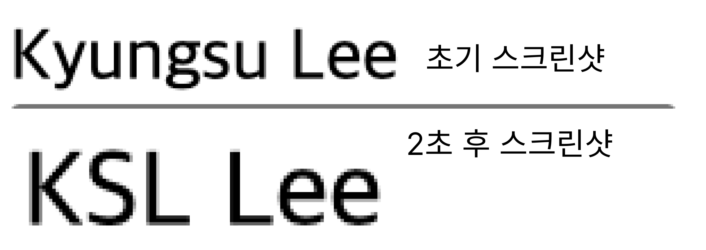
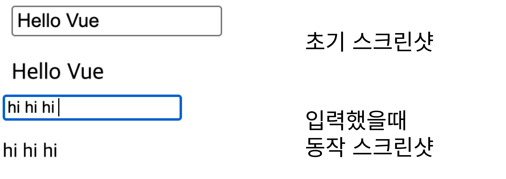
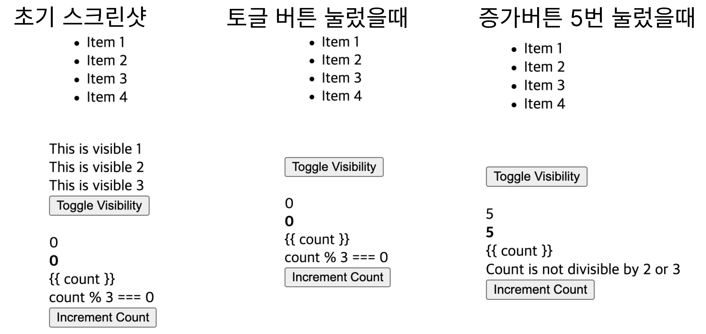
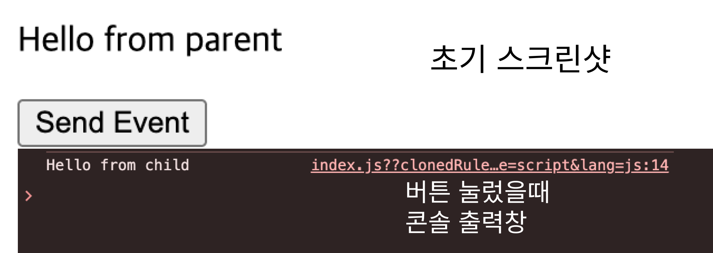
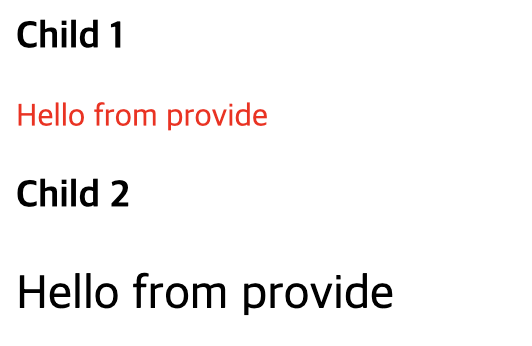
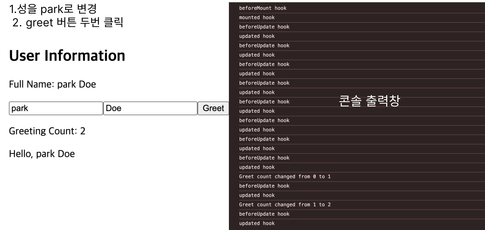

# Vue2 → Vue3 Composition API 전환 예제 모음

---

## 📘 전환된 예제 목록

1. **E01Instance**
2. **E02Reactive**
3. **E03Binding**
4. **E04Directives**
5. **E05ParentComponent**
6. **E06ParentComponent**
7. **E07OptionsApi**

---

## 🔹 변경 요약

### 1. E01Instance
- `data()` 제거 → **setup()**으로 교체
- `import { ref } from 'vue'` 추가
- 기존의 `data()` 안 `message: "Vue!"` 를  
  → `const message = ref("Vue!")` 로 변경

- 동작 스크린샷 

---

### 2. E02Reactive
- `data()`, `computed`, `mounted()` 제거 → `setup()`과 `onMounted()`로 통합
- `ref()`를 사용해 반응형 변수(`firstName`, `lastName`) 선언
- `computed` 훅을 Composition API 방식으로 변환 -> `setup()` 내부로 통합
- `this` 제거, `.value`로 접근 (`firstName.value`)
- `onMounted()` 사용해 컴포넌트 마운트 시 값 변경 처리
- 동작 스크린샷 )

---

### 3. E03Binding
- `data()` 제거 → `setup()` 함수 도입
- `ref()`를 사용해 반응형 변수 `message` 선언
- `import { ref } from 'vue'` 추가
- `this.message` → `message.value` 형태로 변경  
  (템플릿에서는 그대로 `{{ message }}` 사용 가능)
- 동작 스크린샷 

---

### 4. E04Directives
- `data()` 제거 → `setup()` 함수로 전환
- `ref()`를 사용해 반응형 변수 `count`, `isVisible`, `items` 선언
- `import { ref } from 'vue'` 추가
- 기존 객체(`isVisible`, `items`, `count`)를 모두 `ref()`로 감싸 반응형으로 변경
- `return`을 통해 템플릿에서 직접 사용 가능하도록 반환
- 동작 스크린샷 

---

### 5. E05ParentComponent

#### 📁 ChildComponent.vue
- `$emit()` 직접 호출 제거 → `setup()` 내부에서 `emit()` 사용
- `emits: ['custom-event']` 명시적으로 선언
- `setup(props, { emit })` 형태로 이벤트 처리 함수(`customEvent`) 정의
-  버튼 클릭 시 `customEvent()` 호출하도록 변경

#### 📁 ParentComponent.vue
- `data()`, `methods` 제거 → `setup()` 함수로 통합
- `ref()`로 반응형 데이터(`parentMessage`) 선언
- `handleEvent()` 함수를 `setup()` 내부에서 정의 및 반환
- `import { ref } from 'vue'` 추가
-  부모-자식 간 이벤트 통신 구조 유지 (`@custom-event` 사용)
- 동작 스크린샷 

---

### 6. E06ParentComponent

#### 📁 ParentComponent.vue
- `provide()` 옵션 제거 → `setup()` 내부에서 `provide()` 함수 사용
- `ref()`로 반응형 데이터 `sharedMessage` 선언
- `import { provide, ref } from 'vue'` 추가
- 데이터 전달 방식: `provide('sharedMessage', sharedMessage)`

#### 📁 ChildComponent1.vue
- `inject` 옵션 제거 → `setup()` 내부에서 `inject()` 함수 사용
- `import { inject } from 'vue'` 추가
- `const sharedMessage = inject('sharedMessage')`로 데이터 수신
- 자식 컴포넌트2(`ChildComponent2`) 연결 유지

#### 📁 ChildComponent2.vue
- 동일하게 `inject()` 함수로 데이터 수신
- `setup()` 내부에서 `const sharedMessage = inject('sharedMessage')` 정의
- 동작 스크린샷 

---

### 7. E07OptionsApi
- `data`, `methods`, `computed`, `watch`, 라이프사이클  훅 → 모두 `setup()` 내부로 통합
- 라이프사이클 훅을 Composition API 방식(`onMounted`, `onUpdated` 등)으로 변경
- 동작 스크린샷 

---